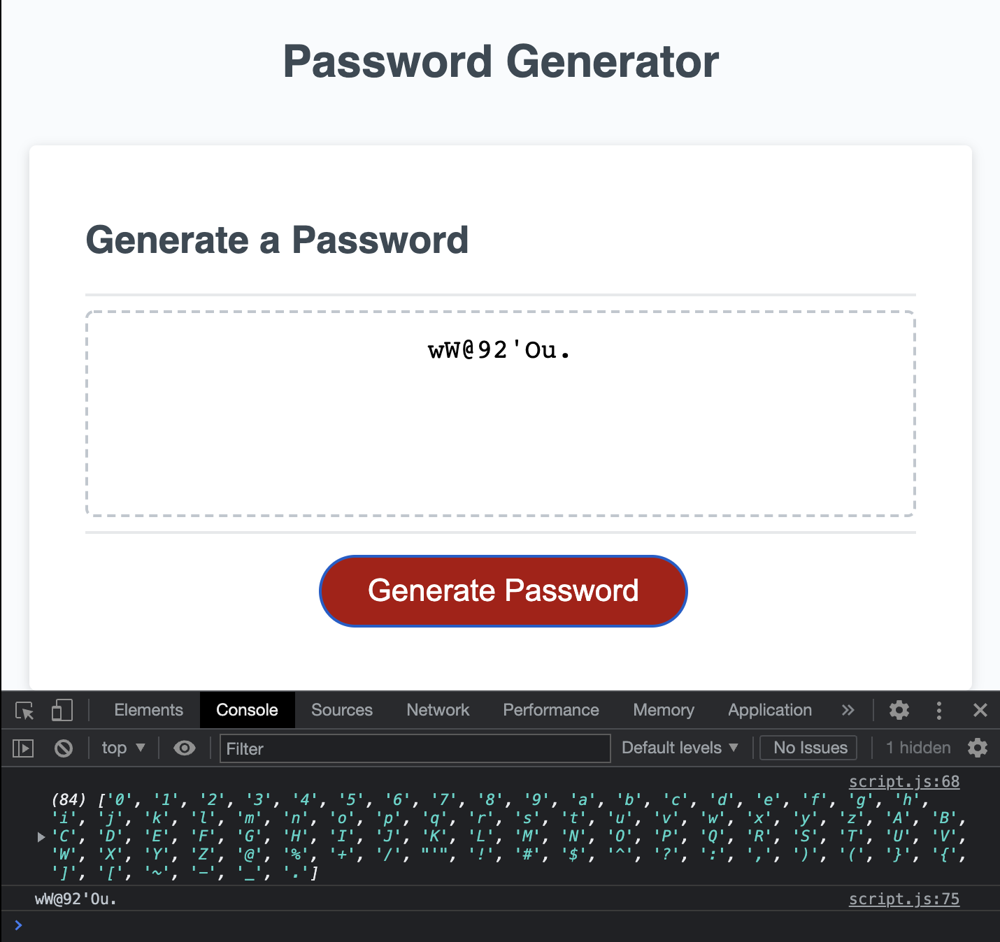

# password-generator

This weeks homework assignment was to modify starter code to create a random password generator. The code included the finished HTML and CSS so the work consisted of javascript. We were given a few functions that needed to be finished. The userInput() function uses a do while loop to get the correct user input. If the user input is not within the given parameters then the function will loop until it is accurate. Once the user puts in their parameters then the function stores the input and returns it. The next function function genPassword() takes the stored inputs to actually create the password. This function accesses the userInput() function to push the different combinations. Once it creates the combinations then uses Math.random() to generate the final password. Lastly the function writePassword() calls the genPassword() function to write the password in the box for the user to see.

[password live link](https://masonfibkins.github.io/password-generator/)

